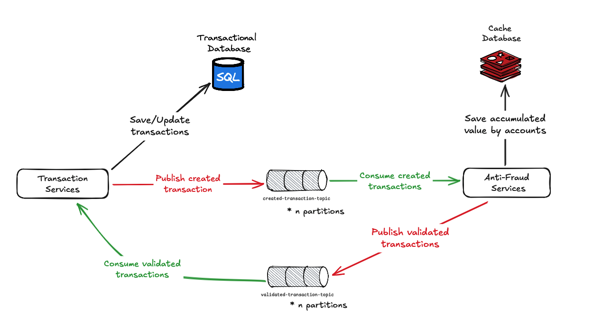

# Transaction Anti-Fraud Validator

Este proyecto es una propuesta de solución para la validación de transacciones a través de un servicio anti-fraude que se encarga de implementar las reglas de negocio necesarias para asegurar la seguridad de los usuarios. Está hecho en una arquitectura basada en eventos (Event-Driven Architecture) y pensado para que pueda seguir creciendo y conservando su escalabilidad y mantenibilidad de código.

Stack Tecnológico:

- .NET 8
- Docker
- Postgres
- Kafka
- Redis

## Caso de Uso:



Las transacciones son recibidas por `TransactionService`, el cual registra dichas transacciones en una base de datos transaccional con un primer estado `Pending`. A su vez, se publica un evento en un tópico de Kafka. El servicio `AntiFraudService` consume los eventos de las transacciones creadas y evalúa si son aprobadas (`Approved`) o rechazadas (`Rejected`) según las reglas del negocio.

### Reglas de validación de la transacción:

- El valor de la transacción no puede exceder los 2000.
- El valor acumulado por día no puede superar los 20000: para esta casuística se definió persistir el valor acumulado en una caché con un tiempo de vida de 24h y asociado a un `SourceAccountId` para validar que la cuenta de origen no supere esta cantidad.

El servicio `AntiFraudService`, una vez validada la transacción, publica un mensaje con el Id y el valor `Approved`: `true` o `false` hacia otro tópico de Kafka donde `TransactionService` consumirá estos mensajes para posteriormente actualizar el estado final de la transacción al correspondiente.

## Estructura del proyecto

```
📂 src
│── 📂 Services
│   │── 📂 TransactionService
│   │   │── TransactionService.Api
│   │   │── TransactionService.Application
│   │   │── TransactionService.Application.Tests
│   │   │── TransactionService.Domain
│   │   │── TransactionService.Infrastructure
│   │── 📂 AntiFraudServices
│   │   │── AntiFraudServices.Api
│   │   │── AntiFraudServices.Application
│   │   │── AntiFraudServices.Application.Tests
│   │   │── AntiFraudServices.Infrastructure
│── 📂 Shared
│   │── Common.Messaging.Kafka
│   │── Common.Messaging.Contracts
│   │── Common.Messaging.Core
│── 📂 Deployments
│   │── docker-compose.yml
```


## Servicios

### TransactionService
- `TransactionService.Api`: Proporciona la API para la gestión de transacciones.
- `TransactionService.Application`: Contiene la lógica de negocio para la gestión de transacciones.
- `TransactionService.Application.Test`: Pruebas unitarias para la lógica de negocio.
- `TransactionService.Domain`: Contiene las entidades y lógica de dominio.
- `TransactionService.Infrastructure`: Contiene la implementación de la infraestructura necesaria para el servicio de transacciones.

### AntiFraudService
- `AntiFraudService.Api`: Proporciona la API para la detección de fraudes.
- `AntiFraudService.Application`: Contiene la lógica de negocio para la detección de fraudes.
- `AntiFraudService.Application.Test`: Pruebas unitarias para la lógica de negocio.
- `AntiFraudService.Infrastructure`: Contiene la implementación de la infraestructura necesaria para el servicio de detección de fraudes.

### Componentes Compartidos

- `Common.Messaging.Contracts`: Define los contratos de mensajería utilizados entre los servicios.
- `Common.Messaging.Core`: Contiene las abstracciones de mensajería.
- `Common.Messaging.Kafka`: Implementación de mensajería utilizando Kafka.

## Definiciones técnicas

### Servicios y componentes compartidos
- La estructura del proyecto se definió en una sola solución para efectos de la prueba y contener todas las dependencias de la solución en una sola estructura y poder probar todo el conjunto con docker-compose. En escenarios productivos es recomendable que cada servicio tenga su propia solución y tenga su propio control de versiones en un repositorio específico. Esto permite dar mayor flexibilidad al implementar pipelines de CI/CD.

- El objetivo de los componentes compartidos es proporcionar mantenibilidad y abstracción a las soluciones que la implementen, como la implementación de Kafka como proveedor de Bus de eventos. Aquí se encontrarán también los contratos de los mensajes que para este caso de uso son reutilizados por ambos servicios, los contratos para manejar los eventos como `EventHandler` y `EventDispatcher` que permiten consumir eventos de forma genérica y asignarles un manejador específico en su implementación. También la segregación en capas que permite mantener las referencias a los proyectos acorde a clean architecture. Idealmente, estos deberían ser publicados como .nuget en un repositorio de artefactos para ser reutilizados cada vez que se necesiten.

- La estructura del proyecto es escalable ya que deja lugar para futuras mejoras como: la implementación de middlewares para centralizar errores, implementación de una capa de seguridad para proteger los endpoints, implementación de sinks personalizados de loggers, etc.

### Eventos y Escalabilidad
- Se han separado los tópicos para que en escenarios productivos la escalabilidad se maneje de forma más aislada. Dependiendo de la concurrencia que pueda tener cada tópico, se podría definir la cantidad de sus particiones, así también como la cantidad de réplicas de los servicios consumidores.
- Se han definido dos tópicos:
    - `created-transactions-topic`: Encargado de gestionar los mensajes de las transacciones creadas por el microservicio de transacciones.
    - `validated-transactions-topic`: Encargado de gestionar los mensajes de las transacciones evaluadas por el microservicio de anti-fraude.
- Como mejoras a esta versión se podrían considerar los siguientes aspectos:
    - Uso de Kafka schema registry para mantener la validación, consistencia y definición de los contratos intercambiados en los eventos.
    - Uso de Kafka Streams para persistir los mensajes y poder trabajar con agregaciones. Esta tecnología podría ayudar en la validación de la acumulación de los valores de transacciones acumulados durante el día, ya que no habría necesidad de implementar una instancia de Redis. Sin embargo, una de las limitaciones para entornos .NET que se encontró es que Kafka Streams solo está disponible para Java ya que trabaja bajo una JVM. Como opción, esta parte se podría apificar en otro servicio.

### Mantenibilidad
- Los servicios han sido desarrollados basados en los conceptos de Clean Architecture, la segregación de dependencias, principios SOLID como: Single Responsibility, Open/Close, Dependency Inversion. Implementación de patrones como: Repository, CQRS y Mediator.
- Se han agregado pruebas unitarias a nivel de aplicación para asegurar la aplicación correcta de los casos de uso, pero para casos productivos se sugiere cubrir de tests a las demás capas.